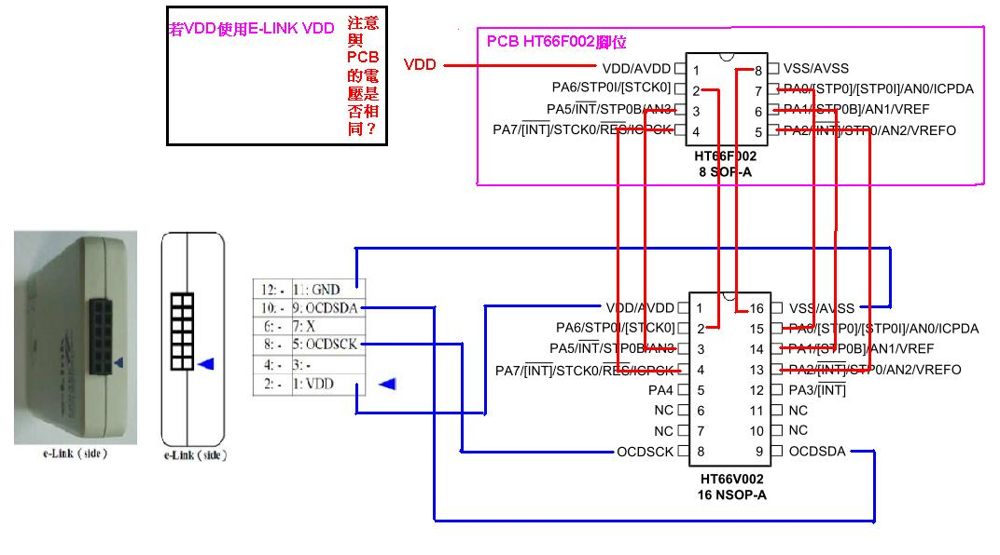
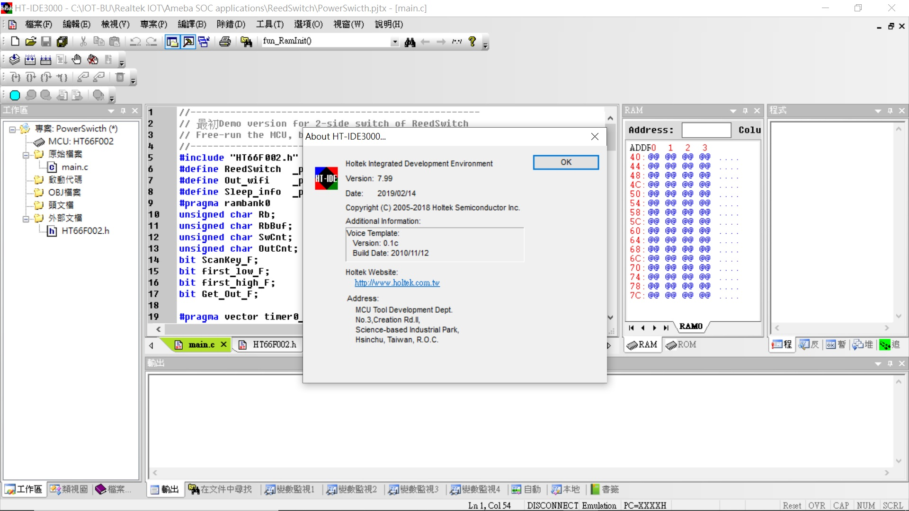
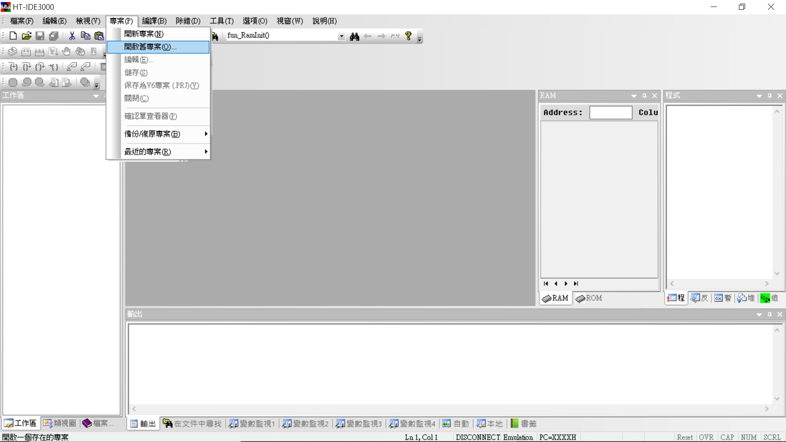
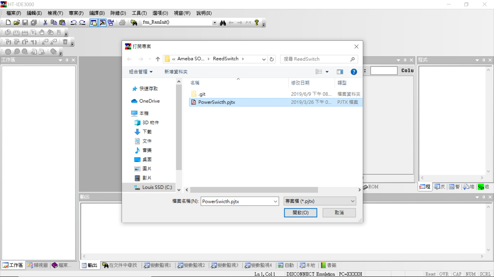
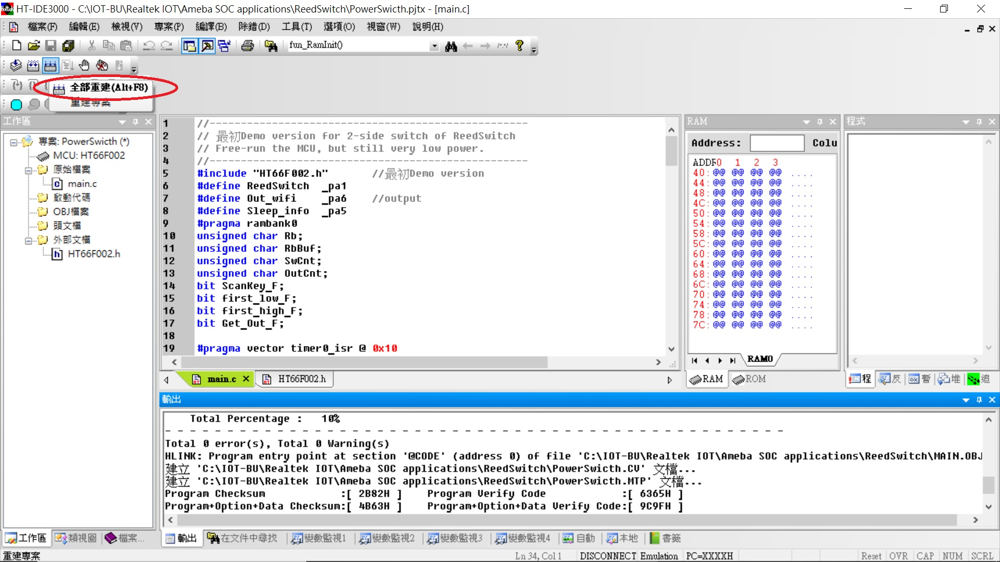

## Demo Reed-switch detect with C-like on HT66F002 8ssop
This code can detect double side of reed-switch and running on very low power consumption

The system code used C-like language of HOLTEK HT66F002 MCU and used internal RC X'tal

No need any components

Free running on HT66F002 always, the power consumption around 15uA @3.3V

HT66F002 for productions, HT66V002 (16nsop) for real-time debug both the pin mapping as the picture

### show pctures in my notebook
* git clone this repo on your side and download the IDE from [Link](https://www.holtek.com/ice)   
* my installed the IDE version

* open this project.   
 

* build or compiler this project.   

