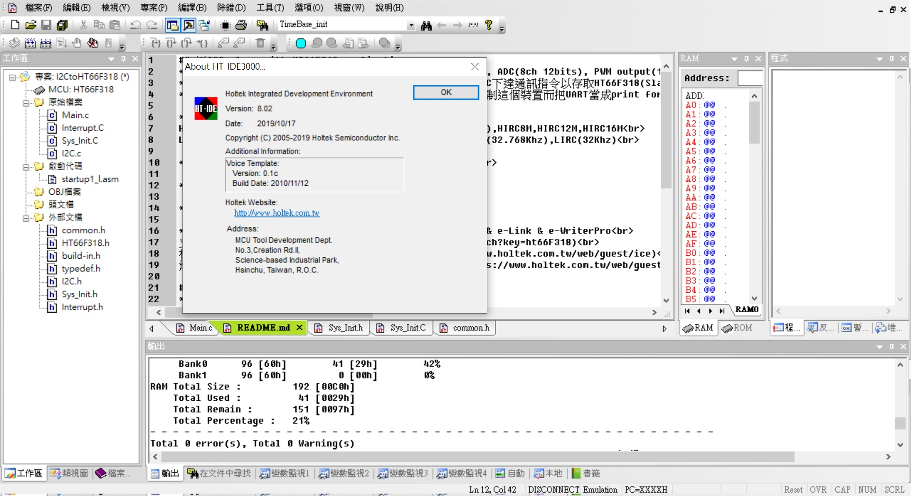

## ※Demo Reed-switch detect with C-like on HT66F002 8ssop
* This code can detect double side of reed-switch and keep running on very low power consumption. 
此專案主要目的是利用reed switch雙向開關, MCU動態檢測輸入訊號, 而MCU可以極低的功耗下持續運行.

* The system code used C-like language of HOLTEK HT66F002 MCU and used internal RC X'tal
C-like Assembler編程方式, 整個程序運行在internal RC低速內振.

* No need any components
不需要外圍任何器件.

Free running on HT66F002 always, the power consumption around 15uA @3.3V
MCU是持續運行但功耗卻可以維持在15微安/3.3V

* HT-IDE3000 HT66F002 8ssop with HT-IDE3000 & e-Link & e-WriterPro 
文件[HT66F002 Document](https://www.holtek.com.tw/documents/10179/11842/HT68F002_0025_003v170.pdf) 
模擬&除錯Development & Debug[IDE3000 & ICE](https://www.holtek.com.tw/web/guest/ice) 
燒入器Progrmming & writer[HOPE3000 & e-WriterPro](https://www.holtek.com.tw/web/guest/programmer) 

### Relevant information
* HT-IDE3000 V8.02

* HOLTEK C Compiler V2/Assembly

* HT66F002 for productions, HT66V002 (16nsop) for real-time debug both the pin mapping as the picture

